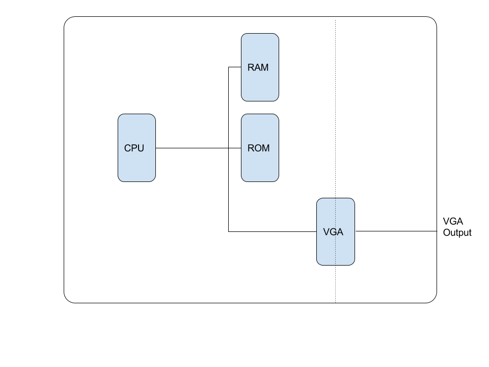
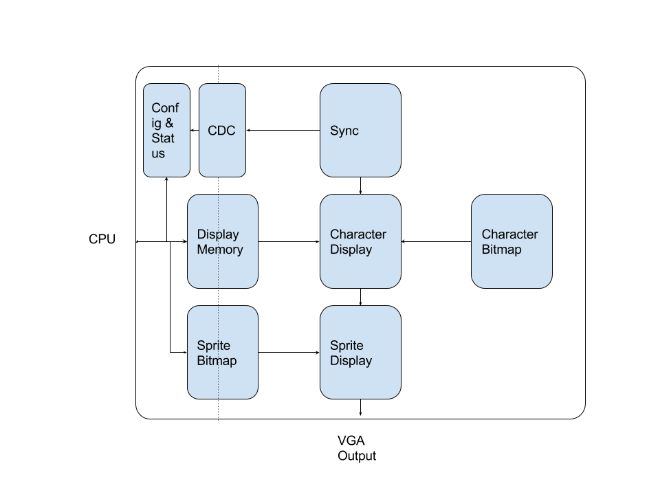

# 6502 inspired computer

This is a computer inspired by the legendary Commodore 64.

## Goal?
The goal of this project is to build a 6502 based computer, complete with a (simple)
operating system. The success criteria is to be able to SSH to the computer
via Ethernet.

The computer is designed to run on both a BASYS2 board and 
a NEXYS4DDR board, both from Digilent.

Of course, the ultimate goal is to have fun building stuff!

## Why?
Well, even though I'm a senior FPGA developer, I've never done anything like
this before. Thus, this is a learning projekt for me.  It is simple enough to
be do-able, and yet useful enough to be interesting.

I've chosen the 6502 because I used it extensively, when I had a C-64 several decades ago.
There is excellent material available - see secion below on resources.

## Design
The computer consists of the following parts:
* 6502 CPU
* Memory (RAM and ROM)
* VGA driver

The following picture shows the block diagram

Note that the dotted line indicates separation between two asynchronous clock
domains. The VGA runs at 25 MHz  (determined by the video mode - 640x480 @ 60
Hz), whereas the CPU runs at a different frequency.

### The 6502 processor
This is an 8-bit processor with 16-bit address bus.  Memory is accessed in
little-endian format.  I/O is accessed through memory-mapped addresses.
It has three 8-bit registers, one 8-bit stack pointer, and one 16-bit program
counter.

Instructions consist of a 1-byte opcode, followed by zero, one, or two byte
operands.

Note: Compared to modern standards, this CPU is very inefficient in that it
only has very few registers.  Therefore programs have to use RAM instead of
registers to do calculations, which makes the programs slower.

### Memory
The BASYS2 board (XC3S250E FPGA from Xilinx) has only a limited amount of
memory (24 kB of synchronous Block RAM and 4 kB of asynchronous Distributed
RAM).  Therefore, only a small amount of memory is supported for the entire
computer.

Note that in order to "imitate" asynchronous RAM, the memory operates on
falling clock edges, whereas the rest of the design operates on rising clock
edges.

The NEXYS4DDR board has external DDR memory, but this will not be used.

### The VGA driver
As written above, the BASYS2 board has limited memory resources. Therefore, the
VGA driver supports a 40x18 character display together with four sprites (16x16
pixels).
The total memory used by the VGA driver is about 4 kB of Block RAM.

The following block diagram shows the architecture of the VGA module.

Notice again the dotted line separating the two clock domains.

## Resources
There is a complete toolchain (C-compiler, assembler, linker, etc) for the 6502 here: 
[https://github.com/cc65/cc65](https://github.com/cc65/cc65). With this, it is possible
to write programs in C, and have it compiled into 6502 machine code, that can be executed
directly on the chip.

Additional resources are:
* x86-to-6502 transpiler. Modern C-compilers for the x86 platform (e.g. GCC) have
excellent optimizers, and thus often lead to better machine code for the 6502, than can
be achieved using the cc65 compiler.
* Functional test. This is an extensive test suite used to verify the functionality
of the 6502 implementation.
* 6502 emulator.  A C-program emulating the 6502 processor can be found here:
[http://rubbermallet.org/fake6502.c](http://rubbermallet.org/fake6502.c)
* www.pagetable.com Nice blog stuffed with knowledge.
* Finally, there is the large repositories at visual6502.org and 6502.org.

## Additional features
You can see more about its features here: [Rockwell Retro Encabulator
](https://www.youtube.com/watch?v=RXJKdh1KZ0w&t=) (That was a joke ...)

