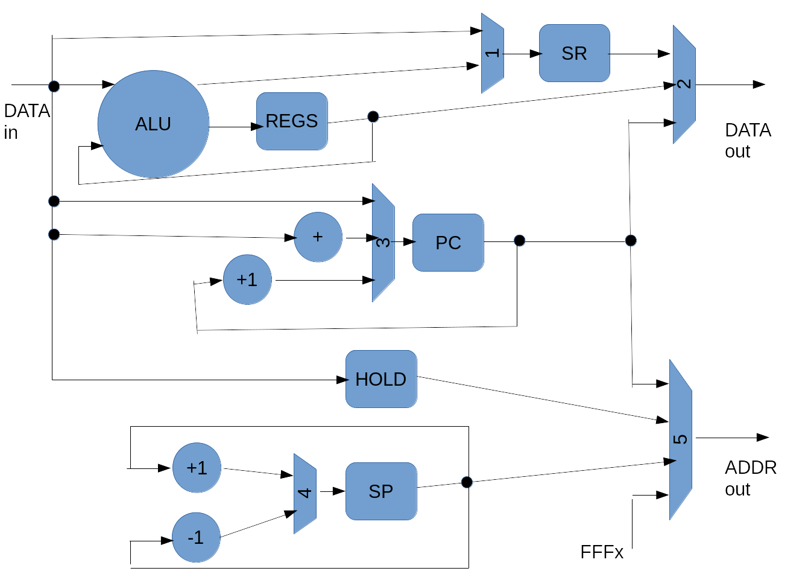

# CPU design and architecture
This folder contains the implementation of the 6502 processor.

# Data path
The following diagram shows the data path through the processore:

My drawing skills are somewhat lacking, but I hope you can get see the big picture.
I've left out a lot of details, in order to keep the diagram fairly simple.

Note: Currently only a few of the addressing modes are implemented (i.e. immediate,
zero-page, and absolute). In order to implement the remaining addressing modes,
it will probably be necessary to make adjustments to this diagram.

In the picture there are 5 multiplexors. I will give a short description of each of them here:
In parenthesis is given the name as it is used in the file ctl.vhd.
1. (WR_SR). This controls what value is written into the Status Regiser.
   Currently, the status values are taken either from the ALU (during ordinary
   calculations) or from the Data input (during RTI).
1. (WR_PC). This controls the update of the program counter. This can either be
   a simple increment by 1 (during normal instruction fetch), or it can be
   increment by a small value (i.e. during a branch relative), or finally it
   can be taken from data input during e.g. a JMP instruction.
1. (WR_SP). This controls the update of the stack pointer. It is either
   increment with 1 (during e.g. PLA), or decrement with 1 (during e.g. PHA).
1. (MEM_WR). This controls the data written to memory. This can either be the
   status register (during e.g. an Interrupt), or the register output (when
   writing register to memory, e.g. STA), or it can be the Program Counter
   during e.g. an interrupt.
1. (WR_ADDR). This controls the address written to memory. This can either be
   the program counter (during normal instruction fetch), or the address hold
   register (during a register read from or write to memory), or the stack
   pointer (during e.g. RTI). Finally, it can be a hardcoded value like FFFE,
   which occurs during an interrupt.

# 6502 implementation notes

## Internal registers
* A (8-bit) accumulator
* X (8-bit) index
* Y (8-bit) index
* SP (8-bit) stack pointer (upper high byte is always 0x01)
* PC (16-bit) program counter

## Addressing modes
* 000: (zero page, X)
* 001: zero page
* 010: #immediate       Take value directly from the incoming data bus.
* 011: absolute         Take value directly from the incoming data bus.
* 100: (zero page), Y
* 101: zero page, X
* 110: absolute, Y
* 111: absolute, X

## Initial design notes
Since the 6502 supports instructions like e.g. INC ($15,X), it must first do
two reads (the two bytes of the instruction), then two additional reads from
memory and one write to memory. This can not be done in a simple pipeline, and
therefore we need a sequential state machine containing microcode.

The main reference for the implementation of this processor is taken from
[http://nesdev.com/6502.txt](http://nesdev.com/6502.txt)

The remainder of this page is largely obsolete, and will soon be deleted.

## Opcode format
Most instructions are of the form AAABBBCC.
* AAA (bits 7-5) : Opcode
* BBB (bits 4-2) : Addressing mode
* CC (bits 1-0) : Opcode

The instruction decoding is described here:
[http://axis.llx.com/~nparker/a2/opcodes.html](http://axis.llx.com/~nparker/a2/opcodes.html)

## ALU operations (13 in total so far) (number of operands in parenthesis)
* Arithmetic shift left 1 bit (ASL) (1)   (1000)
* Logical shift right 1 bit (LSR)   (1)   (1010)
* Rotate left 1 bit (ROL)           (1)   (1001)
* Rotate right 1 bit (ROR)          (1)   (1011)
* Increment with 1                  (1)   (1111)
* Decrement with 1                  (1)   (1110)
* AND                               (2)   (0001)
* OR                                (2)   (0000)
* XOR                               (2)   (0010)
* Add with carry (ADC)              (2)   (0011)
* Subtract with borrow (SBC)        (2)   (0111)
* Compare (same as SBC?)            (2)   (0110)
* Test (same as AND?)               (2)

## Read modify write
The 6502 CPU supports instructions like INC $AAAA, where it
reads a value from memory, sends the value to fhe ALU, and writes
the output of the ALU back to memory. This is called "read-modify-write".
Therefore, one of the inputs to the ALU should be memory read, and the
output of the ALU should be connected to memory write.

## LDA #$40
Let's look at how to implement this instruction.
The byte sequence for this instruction is "A9 40".
The first clock cycle sends the PC to the memory address, and enables memory
read. And increments the PC. 
The second clock cycle it stores the instruction in an internal instruction
register and begins decoding.  It also sends the PC to the memory address, and
enables memory read. And increments the PC.
The third clock cycle it stores the read value in the A register.

## Possible inputs to the ALU
* First  : A register
* Second : Result of addressing mode (only used for some operations)

## Possible outputs from the ALU
* A register

## TBD
* The TXA copies the X register to the A register. Should this go through the
  ALU?
* The LDX register copies the data bus to the X register. Should this go
  through the ALU?

# Example instructions (with possible control signals)

The list below is inspired by this page:
[https://en.wikibooks.org/wiki/6502_Assembly](https://en.wikibooks.org/wiki/6502_Assembly)

I'm looking at the following list of control signals
* ALU_M1 : This is a mux that controls the input to the first port of the ALU
* ALU_M2 : This is a mux that controls the input to the second port of the ALU
* A_M    ; This is a mux that controls the input to the A register
* WA     : This is a write signal to the A register
* X_M    ; This is a mux that controls the input to the X register
* WX     : This is a write signal to the X register
* Y_M    ; This is a mux that controls the input to the Y register
* WY     : This is a write signal to the Y register
* PC_M   ; This is a mux that controls the input to the PC register
* WPC    : This is a write signal to the PC register
* DATA_M : This is a mux that controls what is sent to the data output.
* WDATA  : This is a write signal to the memory.

## ASL
This should copy the A register into the ALU1, and copy the result back into
the A register.
* ALU_M1 : Read from A register
* A_M    : Read from ALU output
* WA     : 1

## TXA
This should copy the X register into the A register.
* A_M    : Read from the X register
* WA     : 1

## LDA #$22
This should copy the data input (second byte of instruction) into the A
register.
* A_M    : Read from the data input
* WA     : 1

## LDX $D010
This should copy the data input (after reading from memory) into the X
register
* X_M    : Read from the data input
* WX     : 1

## LDY @02
This should copy the data input (after reading from memory) into the Y
register
* Y_M    : Read from the data input
* WY     : 1

## BPL $2D
This should copy the PC to the first input of the ALU, and the data
input (second byte of instruction) to the second input of the ALU. The output
should be written into the PC register.
* ALU_M1 : PC
* ALU_M2 : data input
* PC_M   : ALU
* WPC    : 1

## ADC $C001,X
This should add the value $C001 (second and third bytes of the instruction)
with the value in X. The contents of this memory location should be added to
the A register

So first it does:
* ALU_M1 : X
* ALU_M2 : Stored value of second and third byte
* WADDR  : 1

Second it does:
* ALU_M1 : A
* ALU_M2 : data input
* A_M    : ALU
: WA     : 1

## INC $F001,Y
This should add the value $F001 (second and third bytes of the instruction)
with the value in Y. The contents of this memory location are then read, and 
finally written to.

So first it does:
* ALU_M1 : Y
* ALU_M2 : Stored value of second and third byte
* WADDR  : 1

Second it does:
* ALU_M1 : data input
* WTEMP  : 1

Third it does
* DATA_M : From WTEMP
* WDATA  : 1

## LDA $01,X
This should add the value $0001 (second byte of the instruction)
with the value ib X. The contents of this memory location are the read into
the A register.

So first it does:
* ALU_M1 : X
* ALU_M2 : Input data (second byte of instruction)
* WADDR  : 1

Second it does:
* A_M    : ALU
: WA     : 1

## STA ($15,X)
This should add the value $0015 (second byte of the instruction)
with the value in X. The two-byte contents of this memory location
are then stored in a temporary address register, and the value of
A is written to this address

So first it does:
* ALU_M1 : X
* ALU_M2 : Input data (second byte of instruction)
* ALU_OPC : Add with carry clear
* WADDR  : 1

Second it does:
* TEMPL_M  : Input data
* WTEMPL   : 1
* ALU_M1   : X
* ALU_M2   : Input data (second byte of instruction)
* ALU_OPC  : Add with carry set
* WADDR    : 1

Third it does:
* TEMPH_M  : Input data
* WTEMPH   : 1

Fourh it does:
* WADDR   : 1
* DATA_M  : A register
* WDATA   : 1

## LSR ($2A),Y
This reads the two-byte contents of memory address $002A. This is added to 
the Y register and then stored in a temporay address register. The value
at this adress is read, put in the ALU, and then written back.

TBD...

