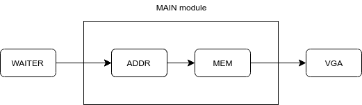

# Design Your Own Computer
# Episode 4a : "Clock Domains"

Welcome to the fourth episode of "Design Your Own Computer". In this episode we
will discuss the concept of Clock Domains and how it applies to our computer.

So far, we've been using a single clock (the VGA clock) of 25 MHz. As our
design grows, we'll be adding other interfaces (e.g. Ethernet) that needs to be
clocked at a different frequency.  And we may want our CPU to be clocked at a
higher frequency than the VGA (think over-clocking!).

It is quite common in larger designs to have multiple clock frequencies. Due to
the risk of
[meta-stability](http://chipdesignmag.com/display.php?articleId=32&issueId=5#)
one must be very careful when connecting signals between different clock domains.

In this design we'll have a total of three different clock domains:
* VGA clock (25 MHz). Used to connect to the VGA output
* Ethernet clock (50 MHz). Used to connect to the Ethernet port.
* Main clock (70 Mhz). Used for everything else, e.g CPU and memory.

## Generating clocks
So far, we've been using a simple counter to generate the VGA clock. But a more
robust (and more general) approach is to use the built-in clock management
features of the FPGA. Using this clock management it is possible to generate
multiple clocks. This is done in the file clk.vhd. This file is actually
auto-generated by using the Clock Wizard feature in Vivado.

The clock management works by multiplying the input frequency (100 MHz) by some
factor (here 10.5), see line 137. Then this faster clock is divided separately
by different divisors (here 21, 42, and 15) to generate the different clocks
(ETH, VGA, MAIN). This generates the three different clock frequencies 50 Mhz,
25 MHz, and 70 MHz respectively.

The clock generation is instantiated in lines 51-61 of comp.vhd.

## Separating the design
Once we have the different clocks we must be careful to keep the clocks
separate.  This is done by moving memory (and later the CPU) to a new file
main.vhd, which will use only the main clock. Signals connected to the other
clock domains, i.e. VGA and ETH, are only referenced in the top-level module
comp.vhd.

This gives a nice hierarchical separation, with the bulk of the design running
on a single clock only.

The main module is implemented in the file main.vhd, and is instantiated in
lines 76-886 of comp.vhd

## Block diagram
The overall structure of the computer in the present state is given in the
following block diagram.

## Signal naming convention
To help keep the signals and clock domains organized, all signals in comp.vhd
will have their names prefixed with the clock domain. So e.g. all signals
connected to the MAIN module will have their names prefixed with "main\_". This
indicates that these signals are synchronous to the main\_clk. Similarly with
the other clock domains. This helps to guard against unintentionally
transferring a signal from one clock domain to another.

## Clock domain crossing (CDC)
We do need to pass *some* signals from one clock domain to another. For
instance, we have the overlay signals, i.e. memory address and data, that
belong to the MAIN clock, but needs to be passed on to the VGA clock domain.
This is conveniently handled by another FPGA primitive.

The clock crossing is instantiated in lines 91-107 of comp.vhd. Lines 5-6 of
comp.vhd are needed to access this primitive, and furthermore line 8 of
comp.tcl is needed as well. Finally, we can remove the line "generated\_clocks"
from comp.xdc.

