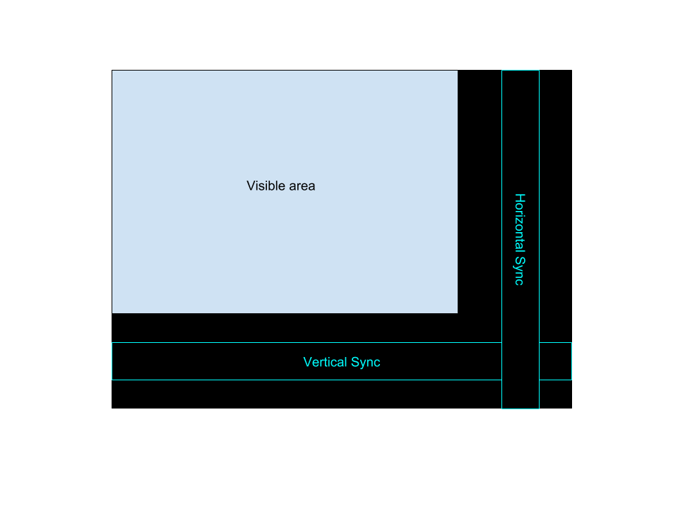

# Design Your Own Computer - Episode 1 : "Hello World"

Welcome to this first episode of "Design Your Own Computer", where we draw a
checker board pattern on the VGA output.

## Files generated in this series:
* vga.vhd   : Main source file
* vga.xdc   : Pin locations (specific for each FPGA board)
* vga.tcl   : List of commands for Vivado
* Makefile  : Overall project makefile

## Key learnings in this episode:
* Each signal may only be assigned values in one process. If more than one process
is assigning to a signal, then the error "Multiple Drivers" will result. This is
because this essentially corresponds to a short-ciruit within the FPGA, and
fortunately the toolchain prevents that :-)

## VGA colour
The colour to the monitor is in the form of three analog signals, one for
each of the primary colours Red, Green, and Blue. Since the FPGA can only
generate digital signals, a simple Digital-to-Analog converter is built into
the board, in the form of a resistor network. In that way, the Nexys 4 DDR
board supports four bits of information for each of the three colour channels,
i.e. 12 colour bits.  However, since this is going to be an 8-bit computer, we
will only use three bits for red and green, and two bits for blue. Values for
some common colours are defined in lines 32-37 in vga.vhd.

## VGA timing
In this project we will work with a resolution of 640x480 pixels @ 60 Hz screen
refresh rate.  The VGA monitor draws one line at a time, starting from the top,
and in each line draws one pixel at a time, from left to right.  However, due
to historical reasons, the timing actually corresponds to a larger area of in
total 800x525 pixels, indicated as the black regions in the diagram below

It is essential that the colour output is exactly zero (black) when outside the
visible region.  The two narrow bands in the diagram shows the timing of the
two synchronization signals, *hs* and *vs*.  All the timing signals for this
screen resolution is described on
[page 17](http://caxapa.ru/thumbs/361638/DMTv1r11.pdf)
in the VESA monitor timing standard.
The relevant timing parameters are defined in lines 17-30 in vga.vhd.

## Pixel counters
In the VHDL code we will have two pixel counters, x and y, where y is positive
down. They will count from 0 to 799 and 0 to 524 respectively. These counters
are generated in lines 71-97 in vga.vhd. And in lines 100-124 we generate the 
two synchronization signals.

## Colour pattern
In this design we just start with a simple checkboard pattern. This can be achieved
by a simple XOR of the x and y coordinates. This is done in lines 127-142 in vga,vhd.

## Clock input
The VGA timing for this particular screen resolution requires a pixel clock of
25 Mhz. However, the crytal oscillator on the FPGA board need not have this 
precise frequency. On the Nexys 4 DDR board the oscillator has a frequency of 100
MHz. This frequency can conveniently be divided by 4 using a simple 2-bit counter.
This clock divider is implemented in lines 56-68 of vga.vhd.

## Pin locations
The toolchain needs to know which pins on the FPGA to use, and for this we must refer to the
[page 7](https://reference.digilentinc.com/_media/reference/programmable-logic/nexys-4-ddr/nexys-4-ddr_sch.pdf)
on the hardware schematic diagram of the particular board used.
The toolchain also needs to know the clock frequencies used in the design. These are
described in lines 18-20 in vga.xdc.

## Build files
Finally we write a small tcl-script, which is needed by the Vivado tool. Notice that
in lines 2 and 3 we define all the sources files in the design, and in line 4 we specify
the particular FPGA model numnber on the FPGA board. In the case of the Nexys 4 DDR it is
an Artix 7 FPGA.

And then there is a simple Makefile. You will of course need to update line 1
in the Makefile with your particular Xilinx install location. The Makefile
defines three targets:
* vga.bit : This synthesizes (=compiles) the design and generates a binary file.
* fpga    : This transfers the binary file to the FPGA and starts the FPGA.
* clean   : This deletes all generated files and returns the directory to its original state.

## Congratulations
And that's it! You can now program the FPGA, and it should generate a nice checkboard pattern
on the monitor. Now sit back and enjoy your succes, the fruits of your labour! In the next
episode, we will expand on the design, adding simple text to the screen.

