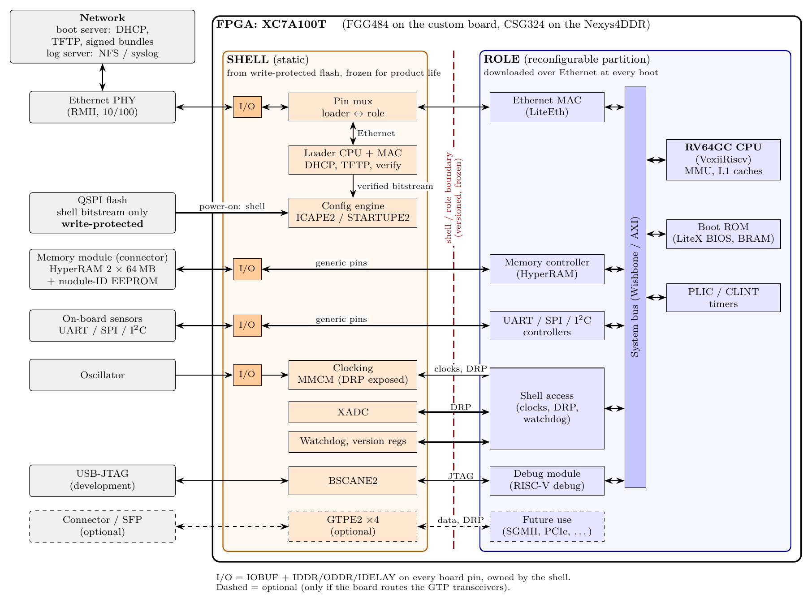

# Linux on Artix-7: Architecture

Status: proposal, 2026-09-23. This document records the conclusions of the
initial architecture investigation. Statements marked **(verify)** are
believed correct but must be confirmed before they are relied upon; they are
collected in [Open items](#14-open-items-to-verify).
Where each group should begin is described in [FIRST_STEPS.md](FIRST_STEPS.md).

## 1. Context and requirements

* **Proof-of-concept board:** Digilent Nexys4DDR (Nexys A7-100T):
  XC7A100T-1CSG324C, 128 MB **DDR2**, 16 MB QSPI flash, 10/100 Ethernet
  (LAN8720A PHY, RMII), microSD slot, USB cable providing both JTAG and UART.
* **Product board:** custom board with an XC7A100T in the **FGG484** package
  (4 GTP transceivers). No on-board DDR. RAM is fitted as a module on an
  on-board connector with a narrow pin count (e.g. HyperRAM).
* **Applications:** board-health monitoring and data logging. No hard
  real-time requirements. The only external interface is Ethernet. On-board
  devices are connected via UART, SPI and I²C. No keyboard or display.
* **Developers:** the application developers write **C++** and are not FPGA
  experts. They need excellent debugging using standard tools and methods,
  not a proprietary mix.
* **Lifetime:** product lifetime and support period of **10+ years**.
* **No external processor.** Everything runs in the FPGA.
* **Flash policy:** in production the flash holds only a small, fixed
  **shell** image and is **write-protected**. The goal is to never have to
  update the flash in the field. IP protection is *not* a goal.
* **Software** (FPGA role and Linux) is pushed over the network at every
  boot. **Logs** are written over the network.

## 2. Summary of decisions

| Topic                | Decision                                                                    |
|----------------------|-----------------------------------------------------------------------------|
| CPU                  | RISC-V **RV64GC** (VexiiRiscv) in a LiteX SoC; VexRiscv RV32 as fallback    |
| Linux                | Mainline kernel + OpenSBI; Buildroot for the PoC, Yocto LTS + CIP kernel for the product |
| FPGA structure       | Fixed **shell** in flash + reconfigurable **role** loaded over Ethernet (DFX) |
| Loader               | Small CPU in the shell: DHCP + TFTP, hash-chain streaming verification into ICAP |
| Memory               | HyperRAM, **128 MB** (2 × 64 MB) on the memory-module connector; controller lives in the role |
| Boot                 | PXE-style: shell loads role, role's BIOS loads OpenSBI + kernel + initramfs over TFTP |
| Root filesystem      | initramfs in RAM (production), NFS root (development)                       |
| Logging              | Over the network (NFS or remote syslog)                                     |
| Debug                | gdbserver over Ethernet from VS Code/CLion; QEMU/Renode; OpenOCD + GDB over JTAG |
| Flash protection     | Permanent lock of the flash protection bits (WP# is not usable in quad-SPI mode) |

## 3. Block diagram



The diagram source is [doc/architecture.tex](doc/architecture.tex). Run
`make` in `doc/` to regenerate the PNG.

The FPGA is split into two regions:

* The **shell** (static region) is loaded from flash at power-on and never
  changes during the product's life. It contains almost no logic: the I/O
  primitives for every board pin, clocking, the configuration-related
  primitives, and a small loader.
* The **role** (reconfigurable partition) contains the whole Linux system:
  CPU, system bus, memory controller and all peripheral controllers. It is
  downloaded over Ethernet and written into the FPGA through ICAP at every
  boot.

## 4. Processor

### Options considered

| Option                    | ISA          | Linux                              | Assessment |
|---------------------------|--------------|------------------------------------|------------|
| MicroBlaze (classic) + MMU | Proprietary | PetaLinux / mainline `arch/microblaze` | Mature, but a niche ISA with no Rust/Go and few maintainers. AMD's direction is MicroBlaze V. Risky for 10+ years. |
| MicroBlaze V              | RV32         | Recent **(verify)**                | RISC-V ecosystem, but tied to AMD's flow. |
| VexRiscv (LiteX)          | RV32IMA(FC)  | Buildroot + mainline; Nexys4DDR supported by *linux-on-litex-vexriscv* | Most proven open path on the PoC board. Fallback choice. |
| **VexiiRiscv** (LiteX)    | RV32/RV64GC  | Yes, including Debian demos        | **Chosen**, if it fits (see below). |
| NaxRiscv, Rocket, CVA6    | RV64GC       | Yes                                | Larger; CVA6 targets bigger devices. |
| NEORV32, PicoRV32, Ibex, SERV | RV32, no MMU | No                             | Unsuitable. |

### Why RV64

* **Longevity:** riscv64 is an official Debian architecture (since Debian 13)
  and is widely tested. RV32 Linux and MicroBlaze Linux are minority
  platforms, a real risk over 10+ years.
* **C++ tooling:** AddressSanitizer and Valgrind support riscv64 but not
  riscv32. GCC/Clang, gdb and the C++ standard library work on both.
* **Cost:** more LUTs and roughly 20–30 % more RAM for the same software.

**First experiment:** synthesize VexiiRiscv RV64 with FPU, MMU and caches on
the 100T and check LUT count and Fmax. It must fit inside the role region
alongside the peripherals. If it doesn't, use VexRiscv RV32.

### Why LiteX

LiteX provides the whole SoC: LiteDRAM (supports the Nexys4DDR's DDR2),
LiteEth (RMII), LiteSDCard, a HyperRAM core, JTAG debug, and an
automatically generated devicetree. The FPGA team has to learn Python/Migen.
Own VHDL can be added with `platform.add_source`.

**Commit the generated Verilog** of the CPU core to the repository, so that a
rebuild in 10 years doesn't depend on today's Scala/SpinalHDL toolchain.

## 5. Linux

* **Kernel:** mainline, no vendor forks. For the product, a Civil
  Infrastructure Platform (CIP) super-long-term kernel (e.g. 6.12), which is
  maintained for 10 years. CIP's reference platforms are mainly Arm and x86,
  so budget for own RISC-V testing.
* **Firmware:** OpenSBI (RISC-V machine-mode runtime).
* **Build system:**
  * **Buildroot** for the PoC: simple and fast, supported by LiteX.
  * **Yocto LTS** for the product: 4-year LTS releases and stronger CVE/SBOM
    tooling. Plan a move to the next LTS every few years.
  * PetaLinux only makes sense with MicroBlaze. AMD is moving PetaLinux users
    to a plain Yocto-based flow.
  * A full Debian image needs ≥256 MB RAM and doesn't fit the product.
  * No-MMU Linux (uClinux) is ruled out: no `fork`, poor debugging.

## 6. Shell and role

### 6.1 Design rule

The shell is permanent: any bug in it can never be fixed in the field.
Therefore: **as little logic as possible in the shell, but every I/O pin
reachable from the role.**

### 6.2 Shell contents

On 7-series devices the following must be in the static region, so they are
in the shell:

* **I/O primitives for every board pin:** IOBUF + IDDR/ODDR (+ IDELAY where
  needed). Each pin crosses the boundary as I, O, T and DDR data. Roles use
  them in SDR mode for slow interfaces (UART, SPI, I²C) and DDR mode for fast
  ones (HyperRAM). Pins not exposed now can never be used by any future role,
  so include connector pins that are unused today.
* **Clocking:** MMCM/BUFG, with the MMCM DRP port exposed to the role so that
  future roles can choose their own clock frequencies.
* **Configuration primitives:** ICAPE2, STARTUPE2.
* **BSCANE2:** JTAG access for CPU debugging in the role.
* **XADC:** FPGA temperature and supply voltages, DRP port exposed to the role.
* **GTPE2 transceivers (optional):** see 6.6.

Plus a minimal amount of own logic:

* **Loader:** small no-MMU CPU with firmware in block RAM, a minimal Ethernet
  MAC, and a pin multiplexer that hands the Ethernet pins to the role after
  loading.
* **Watchdog** and a **"reload role" register:** a hung Linux triggers a fresh
  network boot, and a software update is "reload the role", with no power
  cycle.
* **Version and capability registers.**

There is **no memory controller in the shell** (see 6.3). The shell therefore
doesn't depend on which memory module is fitted.

### 6.3 Loader and integrity

The loader streams the role's partial bitstream straight into ICAP and
verifies it on the fly with a **hash chain**:

1. The first file downloaded is a small signed manifest containing the
   SHA-256 of the first chunk.
2. Each chunk (e.g. 4 KB) contains the SHA-256 of the next chunk.
3. The loader verifies the manifest signature, then checks each chunk as it
   arrives and writes it to ICAP only if it matches. TFTP delivers chunks in
   order, so the chain fits naturally.

Only a few KB of block RAM are needed, and nothing reaches ICAP without having
been verified. Verification matters because a partial bitstream can address
configuration frames *outside* the role region.

Further rules:

* **Protocols:** ARP, DHCP, TFTP only. The loader reports board ID, shell
  version and memory-module ID in its DHCP request, and the server returns the
  matching role. Security comes from signatures, not from the transport.
* **Signatures:** the root keys are permanent, so consider **hash-based
  signatures (LMS/XMSS)**: quantum-safe, recommended by CNSA 2.0 for firmware
  signing, and verification is just SHA-256. Embed several root keys and use
  root-signed intermediate signing keys, so a signing key can be retired.
* **Rollback:** the board has no writable storage for a version counter
  (flash is read-only; 7-series eFUSEs can only be programmed via JTAG). If
  rollback protection is required, the loader sends a nonce and the server
  signs {nonce, bundle hash} with an online key certified by the offline
  root. Whether this is needed is a threat-model decision.
* **Robustness:** the loader is permanent, network-facing code. Keep the
  parsers minimal, fuzz them with malformed packets in simulation, and run
  it on a dedicated boot VLAN. Log progress over UART and UDP so failed boots
  can be diagnosed without JTAG.
* **No encryption:** IP protection is not a goal, so neither the role nor the
  bundle is encrypted, and the irreversible AES-only eFUSE is not used. JTAG
  stays fully available.

### 6.4 Flash write protection

* In quad-SPI mode the flash's **WP# pin doubles as IO2**, so it can't be
  tied low for hardware write protection.
* Either configure the FPGA in x1/x2 SPI mode (a ~3.8 MB shell still loads in
  well under a second), or choose a flash device with a **permanent one-time
  lock** of its protection bits.
* The protection must never be controllable from an FPGA pin; otherwise a
  faulty or malicious role could remove it.

### 6.5 The shell/role boundary

This is the most important architectural decision in the project.

* It carries the generic pins, clocks, MMCM and XADC DRP ports, the JTAG
  signals from BSCANE2, interrupts, watchdog and version registers, and
  (optionally) the GTP interfaces.
* Every role is built against the locked, routed shell checkpoint. Changing
  the shell means rebuilding every role, so the boundary is versioned and the
  loader announces its version.
* Add spare boundary signals.
* Use `RESET_AFTER_RECONFIG` with role pblocks aligned to clock regions.
* Freeze the shell as late as possible. Development flash isn't
  write-protected, so the shell can evolve until then.

### 6.6 GTP transceivers

The FGG484 package has 4 GTP transceivers, and on 7-series devices they must
be in the static region. A future role (e.g. SGMII/1000BASE-X Ethernet, PCIe)
can only use them if the shell instantiates them now, with DRP, raw parallel
TX/RX data and reference clocks exposed. Rule:

* If the custom board routes the GTPs to a connector or SFP, instantiate them
  in the shell and test the DRP path thoroughly, e.g. by bringing up gigabit
  Ethernet in a test role.
* If they aren't routed, leave them out.

### 6.7 Fallback: frozen SoC

The simpler alternative is to freeze the **complete SoC** (shell + default
role as one full bitstream) in flash and load only software over the network,
like a PXE-booted PC. That needs no partial reconfiguration, but any CPU or
peripheral bug found over 10+ years must be worked around in software, as with
ASIC errata.

The two approaches converge: the development flash image (shell + default
role) *is* a frozen SoC. The decision can be deferred until after the DFX
experiment on the Nexys4DDR (phase 2 in section 13). Partial reconfiguration
remains the recommendation because it keeps the permanent part small.

## 7. Boot sequence

### Production

```
Power-on
  -> FPGA loads the shell bitstream from write-protected QSPI flash
  -> Loader: DHCP (reports board ID, shell version, memory-module ID)
  -> Loader: TFTP role bitstream, verified chunk by chunk -> ICAPE2
  -> Loader releases the role's reset
  -> Role: LiteX BIOS (block RAM) initializes the memory module
  -> Role BIOS: TFTP OpenSBI + kernel + DTB + initramfs, verify signature
  -> OpenSBI -> Linux (root filesystem in RAM)
```

The board can't boot without the server. Plan redundant boot servers and a
defined loader behaviour (retry, back off, report).

### Development

* The flash holds the full bitstream (shell + default role). No network
  download of the role.
* The LiteX BIOS loads the kernel over TFTP; the root filesystem is
  **NFS-mounted** from the developer's PC. Build on the PC, run immediately
  on the target.
* JTAG loading of bitstreams from Vivado remains available.

## 8. Memory

Linux with an MMU needs at least 32 MB; with RV64 and an in-RAM root
filesystem (10–20 MB rootfs, 6–8 MB kernel) **128 MB is recommended**. The
100T's block RAM (~600 KB) is far too small.

| Memory                  | Pins   | Size             | Bandwidth                       | Assessment |
|-------------------------|--------|------------------|---------------------------------|------------|
| DDR3 x16                | ~45    | 128–512 MB       | High                            | Excluded by pin budget |
| SDR SDRAM x16           | ~38    | 32–64 MB         | ~200 MB/s, low latency          | Simple, but pin-heavy |
| **HyperRAM**            | 12–13  | 8–64 MB per chip | ~200–300 MB/s peak on Artix-7   | **Chosen.** Several suppliers (Infineon, Winbond, ISSI). Large parts are mostly 1.8 V: use a 1.8 V I/O bank. |
| Octal PSRAM (APMemory)  | ~12    | up to 64 MB      | Similar to HyperRAM             | Good second source; different protocol, similar PHY |
| QSPI PSRAM              | 6      | 8 MB             | Low                             | Too small and slow |

* **Configuration:** 2 × 64 MB HyperRAM on a shared bus with separate chip
  selects (~14 pins).
* **Module ID:** each memory module carries an ID (small I²C EEPROM or ID
  resistors), which the loader reports so the server can send the matching
  role.
* **Performance:** HyperRAM latency is high, so use larger L1 caches and
  consider LiteX's L2 cache. Measure real Linux performance with HyperRAM
  early (phase 3).
* Existing HyperRAM controllers: MJoergen/HyperRAM (used in the MEGA65 work)
  and the LiteX HyperRAM core.

## 9. Peripherals and Linux drivers

Choose peripheral IP with **mainline Linux drivers and devicetree bindings**,
so developers get standard interfaces (`/dev/ttyS*`, `/dev/i2c-N`,
`/dev/spidevX.Y`, `/sys/class/hwmon`, IIO) and existing sensor drivers
(LM75, INA2xx, …) work without custom code.

| Peripheral        | IP                     | Linux driver                |
|-------------------|------------------------|-----------------------------|
| UART              | 16550 or LiteUART      | `8250` / `liteuart`         |
| I²C               | OpenCores I²C          | `i2c-ocores`                |
| SPI               | AXI Quad SPI           | `spi-xilinx`                |
| Ethernet          | LiteEth                | `liteeth`                   |
| SD card (Nexys)   | LiteSDCard             | `litex_mmc`                 |
| FPGA temperature and voltages | XADC       | `xilinx-xadc` (IIO) **(verify for the LiteX/DRP variant)** |

Also add a version/ID register so software can check that bitstream and
devicetree match.

## 10. Software development and debugging

The application developers should only ever see standard Linux.

| Layer                         | Used by               | Tools |
|-------------------------------|-----------------------|-------|
| Development without hardware  | Software developers   | Native x86 builds with unit tests; QEMU (`virt` / user-mode); **Renode**, which models LiteX/VexRiscv SoCs |
| Applications on the target    | Software developers   | SSH, **gdbserver + gdb-multiarch** from VS Code / CLion / Eclipse, strace, ltrace, core dumps, remote syslog |
| Kernel and drivers            | Few                   | dmesg, netconsole, pstore/ramoops, KGDB, ftrace |
| Bring-up and boot             | FPGA engineers        | **OpenOCD + GDB** over the existing USB-JTAG cable (via BSCANE2), LiteX BIOS console, UARTBone/JTAGBone, LiteScope, ILA |

* **Host-first C++:** keep a thin hardware layer over `i2c-dev`, `spidev`
  and `hwmon`, so most code and its unit tests run on the developers' PCs
  with ASan, UBSan, Valgrind and clang-tidy. A USB-to-I²C/SPI adapter
  (e.g. FT232H) lets the same code talk to real sensors from a PC.
* **Target debugging:** VS Code's Remote-SSH server doesn't run on RISC-V, so
  run VS Code on the PC and attach to gdbserver on the target (`cppdbg` with
  `miDebuggerServerAddress`).
* **Toolchain:** ship the SDK (Buildroot `make sdk` / Yocto SDK) plus QEMU as
  a **devcontainer or Docker image**. Onboarding is then one step, and CI uses
  the same image.

## 11. Application deployment and logging

* **Development:** NFS root, `scp`/`rsync`, or "deploy and debug" from the IDE.
* **Production:** applications are built into the root filesystem image
  (Buildroot packages / Yocto recipes). The image is part of the signed
  network bundle, so an update means publishing a new bundle on the server
  and reloading the role. No field flashing.
* **Logging:** over the network, via NFS (developers just write a file) or
  remote syslog (TCP/RELP, optionally TLS). Use a RAM ring buffer to cover
  network outages. No local storage interface is needed on the product.

## 12. Long-term maintenance (10+ years)

* **Tools:** archive the exact Vivado version in a VM or container. Roles
  must be built against the shell checkpoint, so the Vivado version matters
  **(verify version-compatibility rules in UG909)**. Archive the LiteX
  version and the generated CPU Verilog.
* **Kernel and userspace:** CIP kernel + Yocto LTS, with planned LTS
  migrations. Security fixes are deployed by updating the server.
* **Devices:** check AMD's current 7-series lifecycle statement and the
  long-term availability of the chosen HyperRAM and flash parts.
* **Regulation:** if sold in the EU, the Cyber Resilience Act requires
  vulnerability handling over the support period. Reporting obligations
  apply from September 2026; the Act applies fully from December 2027.

## 13. Phased plan

1. **Nexys4DDR, no partial reconfiguration:** LiteX + VexiiRiscv (RV64 if it
   fits) on DDR2, network boot, NFS root, gdbserver. Software developers
   start here.
2. **Nexys4DDR, shell/role split:** loader with hash-chain streaming,
   watchdog and reload register, DDR2 controller in the role. **Decision
   point:** partial reconfiguration vs. frozen SoC.
3. **Nexys4DDR + HyperRAM on a Pmod:** HyperRAM controller in the role, and a
   measurement of Linux performance on HyperRAM. Check which Pmod ports have
   series resistors; expect a reduced bus clock through the connector.
4. **Custom board:** FGG484 shell with the GTP decision made, write-protect
   scheme validated, then the shell freeze.

The Nexys4DDR (CSG324) and the custom board (FGG484) need separate shell
builds, and roles are built per shell. The Nexys4DDR proves the method, not
the final binaries.

## 14. Open items to verify

* VexiiRiscv RV64GC (FPU, MMU, caches) resource usage and Fmax on the 100T,
  and whether it fits in the role region with the peripherals.
* DFX licence status for Artix-7 in the free Vivado edition for the chosen
  Vivado version.
* Vivado version-compatibility rules between the locked shell checkpoint and
  later role builds (UG909).
* 7-series DFX restrictions list (UG909): which primitives must be static,
  pblock rules, `RESET_AFTER_RECONFIG`.
* Current Linux support status of MicroBlaze V (only relevant if AMD's core
  is reconsidered).
* Linux driver for the XADC when accessed through the shell's DRP port rather
  than the AXI XADC Wizard.
* Flash device with a permanent protection lock, and its behaviour with
  7-series SPI configuration in x1/x2 mode.
* Availability and voltage of 64 MB HyperRAM devices from more than one
  supplier.
* Pmod series resistors on the Nexys4DDR, for the HyperRAM experiment.
* AMD's current 7-series product-lifecycle statement.

## 15. References

* AMD UG909: *Vivado Design Suite User Guide: Dynamic Function eXchange*
* AMD UG470: *7 Series FPGAs Configuration User Guide* (ICAPE2, MultiBoot,
  SPI configuration)
* LiteX: <https://github.com/enjoy-digital/litex>
* linux-on-litex-vexriscv: <https://github.com/litex-hub/linux-on-litex-vexriscv>
* VexiiRiscv: <https://github.com/SpinalHDL/VexiiRiscv>
* OpenSBI: <https://github.com/riscv-software-src/opensbi>
* Renode: <https://renode.io>
* Civil Infrastructure Platform: <https://www.cip-project.org>
* NIST SP 800-208 (LMS/XMSS)
