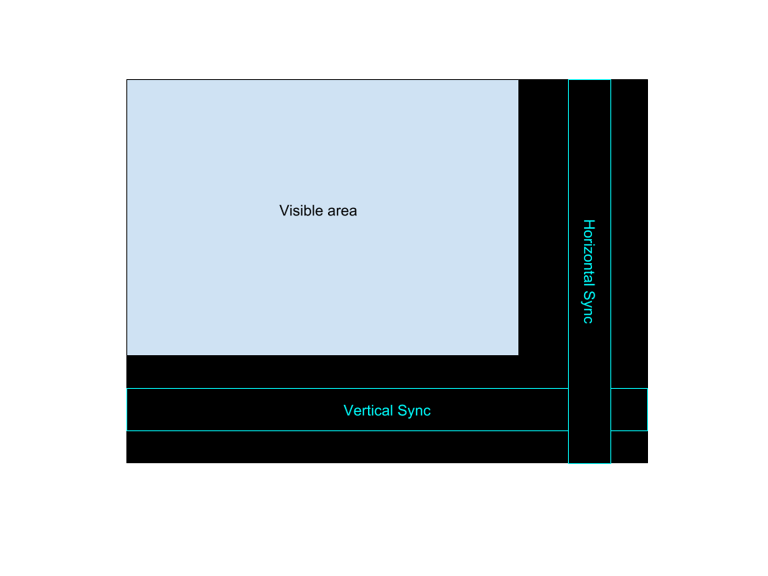
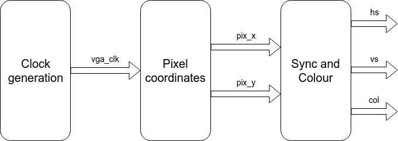

# CPU offloader
# Episode 1 : "Hello World"

Welcome to this first episode of "CPU offloader", where we draw a
checker board pattern on the VGA output.

## Files written in this episode:
* top.vhd  : Main source file
* top.xdc  : Pin locations (specific for each FPGA board)
* top.tcl  : List of commands for Vivado
* Makefile  : Overall project makefile

The above files constitute the bare necessities for a FPGA project. As this project
grows we will add more source files. However, the top.vhd will remain the "top level"
source file, and the project name is "top". This project name is referenced in
line 4 of top.tcl, and is defined in lines 11, 19, and 21 in the file top.vhd.

## Key learnings in this episode:
* Each signal may only be assigned values in one process. If more than one process
is assigning to a signal, then the error "Multiple Drivers" will result. This is
because this essentially corresponds to a short-ciruit within the FPGA, and
fortunately the toolchain prevents that :-)

## VGA colour
The colour to the monitor is in the form of three analog signals, one for each
of the primary colours Red, Green, and Blue. Since the FPGA can only generate
digital signals, a simple Digital-to-Analog converter is built into the board,
in the form of a resistor network. In that way, the Nexys 4 DDR board supports
four bits of resolution for each of the three colours, i.e. a total of 12
colour bits.

## VGA timing
In this project we will work with a resolution of 640x480 pixels @ 60 Hz screen
refresh rate.  The VGA monitor draws one line at a time, starting from the top,
and in each line draws one pixel at a time, from left to right.  However, due
to historical reasons, the timing actually corresponds to a larger area of in
total 800x525 pixels, indicated as the black regions in the diagram below

It is essential that the colour output is exactly zero (black) when outside the
visible region.  The two narrow bands in the diagram show the timing of the
two synchronization signals: *hs* and *vs*.  All the timing signals for this
screen resolution is described on
[pages 11 and 17](http://caxapa.ru/thumbs/361638/DMTv1r11.pdf)
in the VESA monitor timing standard.
The relevant timing parameters are defined in lines 23-36 in top.vhd. I've tried
to give the constants names that are recognizable from the above VESA standard.

## Block diagram
The diagram below shows the overall structure of the design:

The design will be split into three different blocks:
* Clock generation
* Pixel coordinates
* Sync and colour

### Clock generation
The VGA timing for this particular screen resolution requires a pixel clock of
(approximately) 25 Mhz. However, the crytal oscillator on the FPGA board need
not have this precise frequency. On the Nexys 4 DDR board the oscillator has a
frequency of 100 MHz. This frequency can conveniently be divided by 4 using a
simple 2-bit counter.  This clock divider is implemented in lines 68-80 of
top.vhd.

There are ways to achieve clock rates that are rational multiples of the input clock
rate, but to keep this simple (and portable) we'll just stick with this
simple frequency divider.

### Pixel coordinates
In the VHDL code we will have two pixel counters, x and y, where y is positive
down. They will count from 0 to 799 in the x-direction and from 0 to 524 in the
y-direction. These counters are generated in lines 83-109 in top.vhd. And in
lines 112-141 we generate the two synchronization signals.

### Sync and colour
In this design we just start with a simple checkboard pattern. This can be achieved
by a simple XOR of the x and y coordinates. This is done in lines 138-156 in top.vhd.

Notice how both the synchronization signals and the colour output are all functions
of the current pixel coordinates. This is important and ensures that the relative
timing between the colour signal and the synchronization signals matches that of
the VESA standard.

## Timing
Some words on the timing of the synchronization and colour signals. It is
important that the timing specification in the VESA standard is followed. In
our implementation both the synchronization signals and the colour signals are
derived from (i.e. functions of) the pixel counters. So in lines 112-141 of
top.vhd the synchronization signals are driven in a clocked process. This means
that the synchronization signals are delayed one clock cycle compared to the
pixel counters. However, the same applies to the colour signals driven in lines
144-164. Here too, the signals are delayed one clock cycle.
All-in-all, since both the synchronization signals and the colour signals are
delayed the same amount, they will be mutually consistent.

Later, we'll add more clock cycle delays in the colour generation, and we must
therefore ensure the same amount of delay in the synchronization signals.

I highly encourage you to play around with the delay of either the
synchronization signals or the colour signals to see what happens.

## Pin locations
The toolchain needs to know which pins on the FPGA to use, and for this we must refer to the
[page 7](https://reference.digilentinc.com/_media/reference/programmable-logic/nexys-4-ddr/nexys-4-ddr_sch.pdf)
on the hardware schematic diagram of the particular board used.
All pin locations must be specified. They are defined in lines 5-16 in top.xdc. The comments
at the end of each line refers to the signal name used in the hardware schematic diagram.
The corresponding signal names are defined in lines 13-17 in top.vhd.
The toolchain also needs to know the clock frequencies used in the design.
These are described in lines 18-20 in top.xdc.

## Build files
Finally we write a small tcl-script, which is needed by the Vivado tool. Notice
that in lines 2 and 3 we define all the source files in the design. The option
"-vhdl2008" is to signify that we use VHDL standard from 2008 as opposed to the
older standard from 1993. The difference is quite small, but the newer standard
makes it easier to convert (cast) between the data types "std\_logic\_vector"
and "integer".  In line 4 we specify the particular FPGA model number on the
FPGA board. In the case of the Nexys 4 DDR it is an Artix 7 FPGA.

And then there is a simple Makefile. You will of course need to update line 1
in the Makefile with your particular Xilinx install location and version. The
Makefile defines three targets:
* top.bit  : This synthesizes (=compiles) the design and generates a binary file.
* fpga     : This transfers the binary file to the FPGA and starts the FPGA.
* clean    : This deletes all generated files and returns the directory to its
             original state.

## Files generated
When building the project, two files are generated:
* top.bit : This is the bit file to be programmed into the FPGA
* top.dcp : This is a Design Check Point, which contains the design in a
  compiled format that can be opened in the Vivado tool for examination. We
  will not be using this feature right now, but it can be useful for debugging.

## Congratulations
And that's it! You can now program the FPGA, and it should generate a nice
checkboard pattern on the monitor. Now sit back and enjoy your succes, the
fruits of your labour!

I strongly encourage you to play around with this design, and try to make other
patterns on the screen.  What happens if the VGA colour is not black outside
the visible screen?

In the next episode we will expand on the design and make it possible to
display binary digits.

