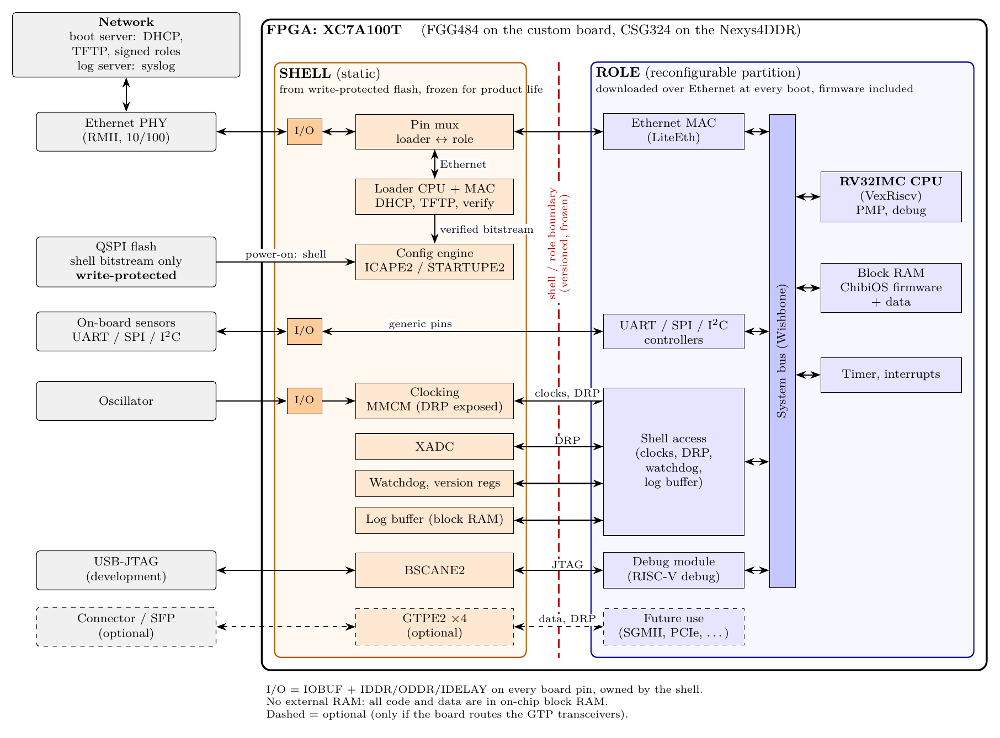

# Soft-core CPU on Artix-7: Architecture

Status: proposal, updated 2026-09-24. The operating system is now **ChibiOS**
on a microcontroller-class **RISC-V** core; the first version of this document
proposed Linux (see [section 5.4](#54-why-not-linux)). Statements marked
**(verify)** are believed correct but must be confirmed before they are relied
upon; they are collected in [Open items](#14-open-items-to-verify).
Where each group should begin is described in [FIRST_STEPS.md](FIRST_STEPS.md).

## 1. Context and requirements

* **Proof-of-concept board:** Digilent Nexys4DDR (Nexys A7-100T):
  XC7A100T-1CSG324C, 16 MB QSPI flash, 10/100 Ethernet (LAN8720A PHY, RMII),
  USB cable providing both JTAG and UART. Its 128 MB DDR2 is not needed.
* **Product board:** custom board with an XC7A100T in the **FGG484** package
  (4 GTP transceivers). No external RAM is needed; the board's optional
  memory-module connector is not used by this application.
* **Applications:** board-health monitoring and data logging. No hard
  real-time requirements. The only external interface is Ethernet. On-board
  devices are connected via UART, SPI and I²C. No keyboard or display.
* **Developers:** the application developers write **C++**, are familiar with
  **ChibiOS**, and are not FPGA experts. They need excellent debugging using
  standard tools and methods, not a proprietary mix.
* **Lifetime:** product lifetime and support period of **10+ years**.
* **No external processor.** Everything runs in the FPGA.
* **Flash policy:** in production the flash holds only a small, fixed
  **shell** image and is **write-protected**. The goal is to never have to
  update the flash in the field. IP protection is *not* a goal.
* **Software** (FPGA role including the firmware) is pushed over the network
  at every boot. **Logs** are sent over the network and buffered inside the
  FPGA during outages.
* **ChibiOS licence:** commercial.
* **Remote debug access** in the field is a nice-to-have, not a requirement.

## 2. Summary of decisions

| Topic                | Decision                                                                    |
|----------------------|-----------------------------------------------------------------------------|
| CPU                  | RISC-V **RV32IMC**, microcontroller class (VexRiscv in a LiteX SoC), no MMU |
| Operating system     | **ChibiOS/RT + ChibiOS/HAL** (commercial licence), lwIP for networking     |
| FPGA structure       | Fixed **shell** in flash + reconfigurable **role** loaded over Ethernet (DFX); frozen SoC as the alternative |
| Loader               | Small CPU in the shell: DHCP + TFTP, hash-chain streaming verification into ICAP |
| Memory               | **On-chip block RAM only** (~600 KB); no external RAM                       |
| Boot                 | Shell loads the role; the firmware is part of the role (block RAM contents) |
| Logging              | syslog over the network via lwIP; buffer in shell block RAM, survives role reloads |
| Debug                | OpenOCD + GDB over the USB-JTAG cable (development); logs and crash dumps (field); remote debug deferred |
| Flash protection     | Permanent lock of the flash protection bits (WP# is not usable in quad-SPI mode) |

## 3. Block diagram



The diagram source is [doc/architecture.tex](doc/architecture.tex). Run
`make` in `doc/` to regenerate the PNG.

The FPGA is split into two regions:

* The **shell** (static region) is loaded from flash at power-on and never
  changes during the product's life. It contains almost no logic: the I/O
  primitives for every board pin, clocking, the configuration-related
  primitives, a small loader, and a log buffer.
* The **role** (reconfigurable partition) contains the whole microcontroller:
  CPU, block RAM with the ChibiOS firmware, system bus and all peripheral
  controllers. It is downloaded over Ethernet and written into the FPGA
  through ICAP at every boot.

## 4. Processor

A microcontroller-class core is sufficient: ChibiOS needs no MMU, and the
application (monitoring and logging) needs little performance.

| Option                          | Approx. size (7-series) | Assessment |
|---------------------------------|-------------------------|------------|
| **VexRiscv RV32IMC** (LiteX)    | ~1.5–3k LUTs, ~150 MHz  | **Chosen.** Open source, integrated in LiteX, optional PMP, RISC-V debug. |
| CV32E40P (OpenHW)               | ~6–10k LUTs             | Alternative with an industrial verification record. |
| NEORV32, Ibex                   | ~2–4k LUTs              | Alternatives; both have RISC-V debug. |
| Arm Cortex-M1 / M3 (Arm FPGA programme) | ~2–3k / ~10k+ LUTs | Official ChibiOS port, but obfuscated RTL and a licensing dependency over 10+ years. Rejected. |
| MicroBlaze / MicroBlaze V       | small                   | No ChibiOS port. Rejected. |

Size is not the deciding factor: any of these uses only a few percent of the
100T's ~63k LUTs. RISC-V was chosen for long-term control: the source is open,
and porting ChibiOS is a one-time task.

* **Same core in the loader and the application.** One toolchain and one
  debug flow for both.
* **Standard debug:** use a VexRiscv configuration that implements the
  standard RISC-V debug specification, so upstream OpenOCD works
  **(verify: some LiteX VexRiscv variants use an older VexRiscv-specific debug
  protocol that needs a forked OpenOCD)**.
* **PMP** (physical memory protection) gives some isolation without an MMU.
* **Commit the generated Verilog** of the CPU core to the repository, so that a
  rebuild in 10 years doesn't depend on today's Scala/SpinalHDL toolchain.

LiteX is used to build the role: VexRiscv, LiteEth, simple peripherals, and
generated register documentation and C headers (`csr.h`) for the drivers. Own
VHDL can be added with `platform.add_source`.

## 5. Operating system: ChibiOS

### 5.1 Components

* **ChibiOS/RT** kernel and **ChibiOS/HAL**, under a **commercial licence**.
  Check that the licence covers every part used, including any code taken
  from ChibiOS-Contrib, whose files may carry different licences.
* **lwIP** (BSD licence) for TCP/IP, integrated through ChibiOS's MAC driver
  and lwIP bindings.
* **C++:** ChibiOS supports C++ (including its C++ wrappers). Use the usual
  embedded subset (static allocation, typically no exceptions or RTTI), which
  the developers already know from ChibiOS on microcontrollers.

### 5.2 RISC-V port

ChibiOS's RISC-V support is a community port in ChibiOS-Contrib that targets
the GD32VF103's interrupt controller (ECLIC). It must be adapted to the chosen
core's interrupt and timer structure: context switch, interrupt entry and
exit, and the system tick. This is a small, well-defined job.

**Ask the ChibiOS licensor** whether they will do or support the RISC-V port
for this core. A supported port is better than maintaining your own for 10+
years.

### 5.3 Drivers

Every FPGA peripheral needs a ChibiOS HAL low-level driver (LLD). Sensor
drivers are also mostly own code. See [section 9](#9-peripherals-and-chibios-drivers).

### 5.4 Why not Linux

The first version of this architecture used Linux (RV64 with MMU, 128 MB
HyperRAM, Buildroot/Yocto). ChibiOS was chosen because the developers know it,
and it fits the application well. The trade-offs:

| Gained with ChibiOS | Lost compared with Linux |
|---------------------|--------------------------|
| No external RAM, much smaller CPU | Existing drivers: every peripheral and sensor driver is own code |
| One firmware image inside the role; simpler boot | Process isolation: one bad pointer can corrupt everything |
| Deterministic behaviour, small attack surface | Network services (SSH, NFS) and gdbserver-based remote debugging |
| Familiar to the developers | Large ecosystem of libraries and tools |

**Zephyr** is worth a comparison before committing. It already supports the
LiteX/VexRiscv SoC upstream (the `litex_vexriscv` board) with LiteX drivers
for UART, Ethernet, I²C, GPIO and timers, and has a network stack, a sensor
framework, LTS releases and a security-response process. It would remove most
of the porting and driver work, at the cost of learning a new RTOS.

## 6. Shell and role

### 6.1 Design rule

The shell is permanent: any bug in it can never be fixed in the field.
Therefore: **as little logic as possible in the shell, but every I/O pin
reachable from the role.**

### 6.2 Shell contents

On 7-series devices the following must be in the static region, so they are
in the shell:

* **I/O primitives for every board pin:** IOBUF + IDDR/ODDR (+ IDELAY where
  needed). Each pin crosses the boundary as I, O, T and DDR data. Pins not
  exposed now can never be used by any future role, so include connector pins
  that are unused today.
* **Clocking:** MMCM/BUFG, with the MMCM DRP port exposed to the role so that
  future roles can choose their own clock frequencies.
* **Configuration primitives:** ICAPE2, STARTUPE2.
* **BSCANE2:** JTAG access for CPU debugging in the role.
* **XADC:** FPGA temperature and supply voltages, DRP port exposed to the role.
* **GTPE2 transceivers (optional):** see 6.6.

Plus a minimal amount of own logic:

* **Loader:** small RV32 CPU with firmware in block RAM, a minimal Ethernet
  MAC, and a pin multiplexer that hands the Ethernet pins to the role after
  loading.
* **Log buffer:** a dual-port block RAM exposed to the role. Being in the
  static region, it **survives role reloads** (watchdog reset, crash, update),
  though not power loss. The loader writes its own boot log into it, and the
  firmware's fault handler writes crash dumps into it. Its size is frozen with
  the shell, so choose it generously.
* **Watchdog** and a **"reload role" register:** a hung firmware triggers a
  fresh network boot, and an update is "reload the role", with no power cycle.
* **Version and capability registers.**

### 6.3 Loader and integrity

The loader streams the role's partial bitstream straight into ICAP and
verifies it on the fly with a **hash chain**:

1. The first file downloaded is a small signed manifest containing the
   SHA-256 of the first chunk.
2. Each chunk (e.g. 4 KB) contains the SHA-256 of the next chunk.
3. The loader verifies the manifest signature, then checks each chunk as it
   arrives and writes it to ICAP only if it matches. TFTP delivers chunks in
   order, so the chain fits naturally.

Only a few KB of block RAM are needed, and nothing reaches ICAP without having
been verified. Verification matters because a partial bitstream can address
configuration frames *outside* the role region.

Further rules:

* **Protocols:** ARP, DHCP, TFTP only. The loader reports board ID and shell
  version in its DHCP request, and the server returns the matching role.
  Security comes from signatures, not from the transport.
* **Signatures:** the root keys are permanent, so consider **hash-based
  signatures (LMS/XMSS)**: quantum-safe, recommended by CNSA 2.0 for firmware
  signing, and verification is just SHA-256. Embed several root keys and use
  root-signed intermediate signing keys, so a signing key can be retired.
* **Rollback:** the board has no writable storage for a version counter
  (flash is read-only; 7-series eFUSEs can only be programmed via JTAG). If
  rollback protection is required, the loader sends a nonce and the server
  signs {nonce, bundle hash} with an online key certified by the offline
  root. Whether this is needed is a threat-model decision.
* **Robustness:** the loader is permanent, network-facing code. Keep the
  parsers minimal, fuzz them with malformed packets in simulation, and run
  it on a dedicated boot VLAN. Log progress over UART, UDP and into the log
  buffer, so failed boots can be diagnosed without JTAG.
* **No encryption:** IP protection is not a goal, so the role isn't
  encrypted, and the irreversible AES-only eFUSE is not used. JTAG stays
  fully available.

### 6.4 Flash write protection

* In quad-SPI mode the flash's **WP# pin doubles as IO2**, so it can't be
  tied low for hardware write protection.
* Either configure the FPGA in x1/x2 SPI mode (a ~3.8 MB shell still loads in
  well under a second), or choose a flash device with a **permanent one-time
  lock** of its protection bits.
* The protection must never be controllable from an FPGA pin; otherwise a
  faulty or malicious role could remove it.

### 6.5 The shell/role boundary

This is the most important architectural decision in the project.

* It carries the generic pins, clocks, MMCM and XADC DRP ports, the JTAG
  signals from BSCANE2, the log-buffer port, interrupts, watchdog and version
  registers, and (optionally) the GTP interfaces.
* Every role is built against the locked, routed shell checkpoint. Changing
  the shell means rebuilding every role, so the boundary is versioned and the
  loader announces its version.
* Add spare boundary signals.
* The role's pblock must contain enough block RAM columns for the firmware
  (see [section 8](#8-memory-block-ram-budget)).
* Use `RESET_AFTER_RECONFIG` with role pblocks aligned to clock regions.
* Freeze the shell as late as possible. Development flash isn't
  write-protected, so the shell can evolve until then.

### 6.6 GTP transceivers

The FGG484 package has 4 GTP transceivers, and on 7-series devices they must
be in the static region. A future role (e.g. SGMII/1000BASE-X Ethernet, PCIe)
can only use them if the shell instantiates them now, with DRP, raw parallel
TX/RX data and reference clocks exposed. Rule:

* If the custom board routes the GTPs to a connector or SFP, instantiate them
  in the shell and test the DRP path thoroughly, e.g. by bringing up gigabit
  Ethernet in a test role.
* If they aren't routed, leave them out.

### 6.7 Alternative: frozen SoC

The simpler alternative is to freeze the **complete SoC** (shell + role as one
full bitstream) in flash, and load only the firmware over the network into
block RAM with a small bootloader. That needs no partial reconfiguration, but
any CPU or peripheral bug found over 10+ years must be worked around in
firmware, as with microcontroller errata.

With a microcontroller-class SoC this alternative is much more attractive
than it was for Linux: the SoC is small and far easier to verify to "freeze
forever" quality. Partial reconfiguration is still worth it if FPGA logic
other than the CPU is expected to change over the product's life. The
decision is made after the DFX experiment on the Nexys4DDR (phase 2 in
[section 13](#13-phased-plan)). The two approaches converge: the development
flash image (shell + default role) *is* a frozen SoC.

## 7. Boot sequence

### Production

```
Power-on
  -> FPGA loads the shell bitstream from write-protected QSPI flash
  -> Loader: DHCP (reports board ID and shell version)
  -> Loader: TFTP role bitstream incl. firmware in block RAM,
             verified chunk by chunk -> ICAPE2
  -> Loader releases the role's reset
  -> ChibiOS starts from block RAM
```

There is no second download stage: the firmware is part of the role's
bitstream, so one file carries one signature.

The board can't boot without the server. Plan redundant boot servers and a
defined loader behaviour (retry, back off, report).

### Development

* The flash holds the full bitstream (shell + default role with firmware).
* New firmware is loaded **straight into block RAM with GDB's `load`** over
  JTAG, in seconds and without rebuilding the bitstream, just like flashing a
  microcontroller.
* JTAG loading of bitstreams from Vivado remains available.

## 8. Memory: block RAM budget

There is no external RAM. The XC7A100T has 135 × 36 Kb block RAMs, about
600 KB in total, shared between shell and role. Initial budget, to be
replaced by measurements:

| Use                                       | Region | Estimate      |
|-------------------------------------------|--------|---------------|
| Loader firmware + chunk buffer            | Shell  | 32–64 KB      |
| Log buffer                                | Shell  | 64–256 KB     |
| ChibiOS/RT + HAL + lwIP + application code | Role  | 100–250 KB    |
| Data, stacks, lwIP/Ethernet buffers       | Role   | 50–100 KB     |

* Track the budget from the start; it is the new limiting resource.
* The log buffer must cover the longest network outage that has to be
  bridged; size it from the log data rate.
* The Nexys4DDR's DDR2 and the product's memory-module connector are not
  needed. The HyperRAM work from the Linux proposal is dropped.

## 9. Peripherals and ChibiOS drivers

Keep the FPGA peripherals **simple and well documented**. The FPGA team owns
the register maps (generated by LiteX as documentation and C headers), and the
software team writes the ChibiOS LLDs, starting from ChibiOS's HAL templates.
Zephyr's LiteX drivers (Apache 2.0) are compact reference implementations for
the same hardware.

| Function          | FPGA IP                        | ChibiOS driver             |
|-------------------|--------------------------------|----------------------------|
| UART              | LiteUART                       | Serial/SIO LLD (own)       |
| SPI               | LiteX SPI master               | SPI LLD (own)              |
| I²C               | LiteX I²C or OpenCores I²C     | I²C LLD (own)              |
| GPIO              | LiteX GPIO                     | PAL LLD (own)              |
| Ethernet          | LiteEth                        | MAC LLD + lwIP bindings (own) |
| System tick       | RISC-V machine timer           | Part of the RISC-V port    |
| Temperature, voltages | XADC via shell DRP port    | Direct register access     |
| Log buffer, watchdog | Shell registers             | Small own driver           |

Making the peripherals register-compatible with STM32, so the existing STM32
drivers could be reused, is not recommended: those drivers depend on STM32
DMA, clock-control and interrupt layouts.

Also add a version/ID register so the firmware can check which role it runs on.

## 10. Software development and debugging

| Layer                         | Used by               | Tools |
|-------------------------------|-----------------------|-------|
| Development without hardware  | Software developers   | ChibiOS **POSIX simulator** port on the PC with unit tests, ASan, UBSan, Valgrind; **Renode** for the LiteX/VexRiscv SoC |
| On the target (development)   | Software developers   | **OpenOCD + GDB** over the USB-JTAG cable, from ChibiStudio or VS Code (Cortex-Debug); GDB `load` into block RAM; ChibiOS state checker, statistics, trace buffer and serial shell |
| In the field                  | Everyone              | syslog over the network; crash dumps and boot log in the shell log buffer; watchdog |
| FPGA bring-up                 | FPGA engineers        | OpenOCD + GDB, UARTBone/JTAGBone, LiteScope, ILA |

* **Host-first C++:** keep the hardware access behind a thin layer, so the
  application logic and its unit tests run on the PC (natively or in the
  POSIX simulator) with sanitizers.
* **Thread-aware debugging:** OpenOCD's ChibiOS awareness is implemented for
  Cortex-M **(verify for RISC-V)**. Adding RISC-V support is a small OpenOCD
  patch; until then, GDB scripts can list ChibiOS threads.
* **Isolation:** use PMP to protect code and stacks, and give the shell
  watchdog a real role in the firmware.
* **Crash dumps:** the fault handler writes registers and the stack into the
  shell log buffer. After the role is reloaded, the new firmware sends the
  dump with the next log batch.
* **Remote debugging (nice-to-have):** can be added later entirely in the
  role, e.g. a GDB remote-protocol stub in the firmware over TCP. **Nothing is
  needed in the shell for it**, so the decision can be deferred. Remote JTAG
  over Ethernet in the shell is not planned: it is non-standard, a security
  exposure, and would be frozen forever.
* **Toolchain:** RISC-V bare-metal GCC, OpenOCD, Renode and the vendored
  ChibiOS sources in a **devcontainer or Docker image**, so onboarding and CI
  use the same environment.

## 11. Application deployment and logging

* **Development:** GDB `load` over JTAG, or a new full bitstream in flash.
* **Production:** the firmware is embedded in the role. An update means
  publishing a new signed role on the server and triggering a role reload.
  No field flashing. A firmware-only change doesn't require a new synthesis
  run: Vivado's `updatemem` inserts new block RAM contents into an existing
  bitstream **(verify how this works with partial bitstreams)**.
* **Logging:** syslog (RFC 5424) over UDP or TCP via lwIP. Log entries are
  written into the shell log buffer first and removed once sent, so they
  survive network outages and role reloads.

## 12. Long-term maintenance (10+ years)

* **ChibiOS:** make sure the commercial licence and support terms cover the
  product's lifetime. Vendor the ChibiOS sources and the RISC-V port, and
  assume you'll maintain your copy yourselves; the code base is small enough
  for that.
* **lwIP:** the main network-facing code in the firmware. Track and patch it.
* **Security:** the attack surface is much smaller than with Linux (lwIP plus
  own protocol code), which also keeps the EU Cyber Resilience Act workload
  small. If sold in the EU, the Act requires vulnerability handling over the
  support period; reporting obligations apply from September 2026 and the Act
  applies fully from December 2027.
* **Tools:** archive the exact Vivado version in a VM or container. Roles
  must be built against the shell checkpoint, so the Vivado version matters
  **(verify version-compatibility rules in UG909)**. Archive the LiteX
  version, the generated CPU Verilog, the GCC toolchain and OpenOCD.
* **Devices:** check AMD's current 7-series lifecycle statement and the
  long-term availability of the chosen flash and PHY.

## 13. Phased plan

1. **Nexys4DDR, no partial reconfiguration:** LiteX SoC with VexRiscv RV32IMC
   running from block RAM, LiteEth, UART, SPI, I²C. ChibiOS RISC-V port
   bring-up, first LLDs, JTAG debugging. Software developers start here.
2. **Nexys4DDR, shell/role split:** loader with hash-chain streaming, watchdog
   and reload register, shell log buffer. **Decision point:** partial
   reconfiguration vs. frozen SoC.
3. **Custom board:** FGG484 shell with the GTP decision made, write-protect
   scheme validated, then the shell freeze.

The Nexys4DDR (CSG324) and the custom board (FGG484) need separate shell
builds, and roles are built per shell. The Nexys4DDR proves the method, not
the final binaries.

## 14. Open items to verify

* VexRiscv configuration with the standard RISC-V debug specification, working
  with upstream OpenOCD through BSCANE2.
* ChibiOS RISC-V port: effort to adapt the ChibiOS-Contrib port, whether the
  commercial licence covers it, and whether the licensor supports it.
* OpenOCD ChibiOS thread awareness on RISC-V.
* Block RAM budget (section 8), measured on real builds.
* `updatemem` with partial bitstreams.
* DFX licence status for Artix-7 in the free Vivado edition for the chosen
  Vivado version.
* Vivado version-compatibility rules between the locked shell checkpoint and
  later role builds (UG909).
* 7-series DFX restrictions list (UG909): which primitives must be static,
  pblock rules, `RESET_AFTER_RECONFIG`, block RAM initialisation in partial
  bitstreams.
* Flash device with a permanent protection lock, and its behaviour with
  7-series SPI configuration in x1/x2 mode.
* AMD's current 7-series product-lifecycle statement.

## 15. References

* AMD UG909: *Vivado Design Suite User Guide: Dynamic Function eXchange*
* AMD UG470: *7 Series FPGAs Configuration User Guide* (ICAPE2, SPI configuration)
* ChibiOS: <https://www.chibios.org>
* ChibiOS-Contrib: <https://github.com/ChibiOS/ChibiOS-Contrib>
* lwIP: <https://savannah.nongnu.org/projects/lwip/>
* LiteX: <https://github.com/enjoy-digital/litex>
* VexRiscv: <https://github.com/SpinalHDL/VexRiscv>
* OpenOCD: <https://openocd.org>
* Renode: <https://renode.io>
* Zephyr (for comparison): <https://www.zephyrproject.org>
* NIST SP 800-208 (LMS/XMSS)
