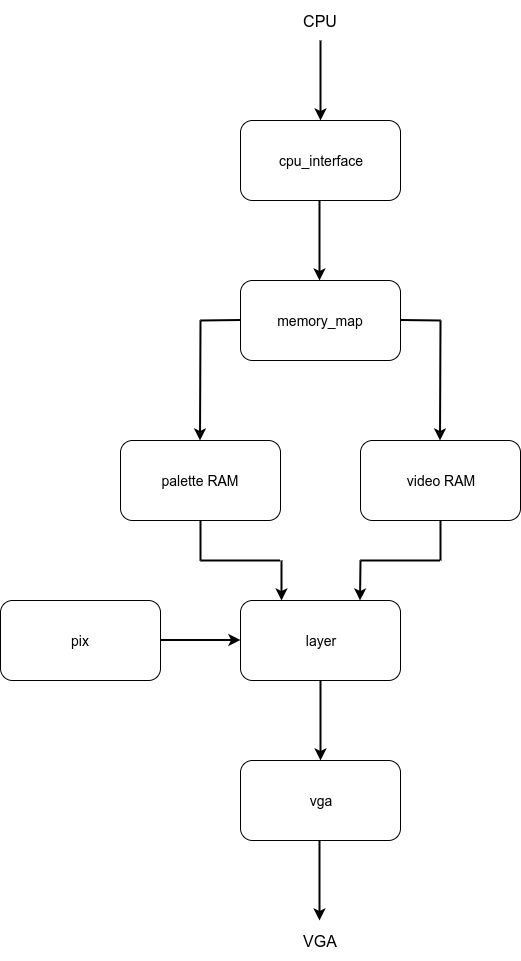

# VERA #

This directory contains an implementation of (a subset of) the VERA chip (version 0.8) for
the Commander X16 computer.

This README contains the notes I've taken during the implementation. These
notes are gathered from the [Official VERA
Documentation](https://github.com/commanderx16/x16-docs/blob/master/VERA%20Programmer's%20Reference.md)
and from the source code for the X16 emulator.

# Block diagram
The figure below shows the block diagram.

This diagram shows that the VERA module has two separate interfaces, one
towards the CPU and one to the VGA monitor. Each interface runs in a separate
clock domain, and the vertical dashed line in the diagram symbolizes the
boundary between the two clock domains.

This design utilizes the Block RAMs of the Xilinx FPGA, which are True Dual
Port, i.e. these Block RAMs allow simultaneous access from two different clock
domains.

## CPU block
This block contains all the logic interfacing to the CPU. This
includes translating between the external (8 byte) memory map visible to the
CPU and the internal (2 MB) memory map.

### Internal memory map
The VERA chip has its own private 2 MB address space, with the following structure:
* 0x00000 - 0x1FFFF : Video RAM (128 kB)
* 0x20000 - 0xEFFFF : Reserved
* 0xF0000 - 0xF001F : Display composer
* 0xF1000 - 0xF11FF : Palette RAM
* 0xF2000 - 0xF200F : Layer 1
* 0xF3000 - 0xF300F : Layer 2
* 0xF4000 - 0xF400F : Sprite registers
* 0xF5000 - 0xF53FF : Sprite attributes
* 0xF6000 - 0xF6FFF : Reserved for audio
* 0xF7000 - 0xF7001 : SPI
* 0xF8000 - 0xFFFFF : Reserved

### Layer settings
* 0x000         : Enabled and Mode
* 0x001         : Map width and height, Tile width and height
* 0x002 - 0x003 : Map Base
* 0x004 - 0x005 : Tile Base
* 0x006 - 0x007 : Horizontal scroll
* 0x008 - 0x009 : Vertical scroll

